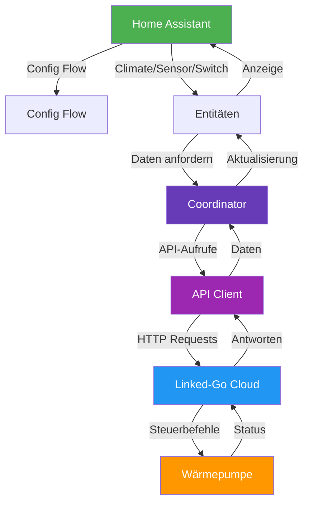
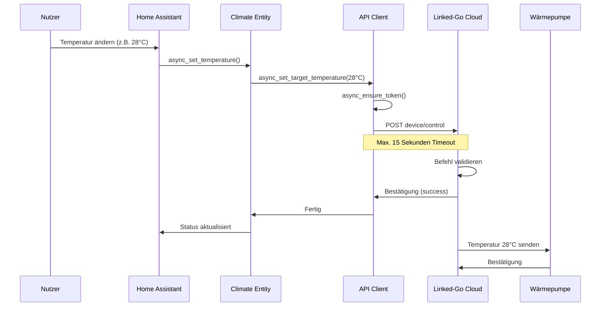
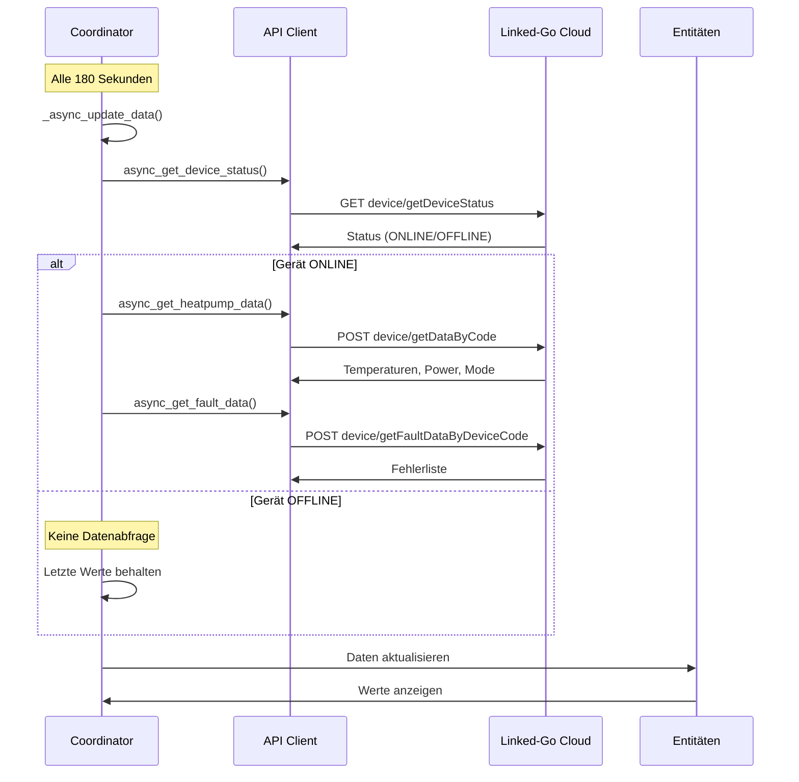
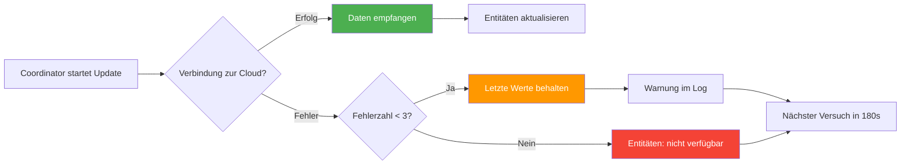
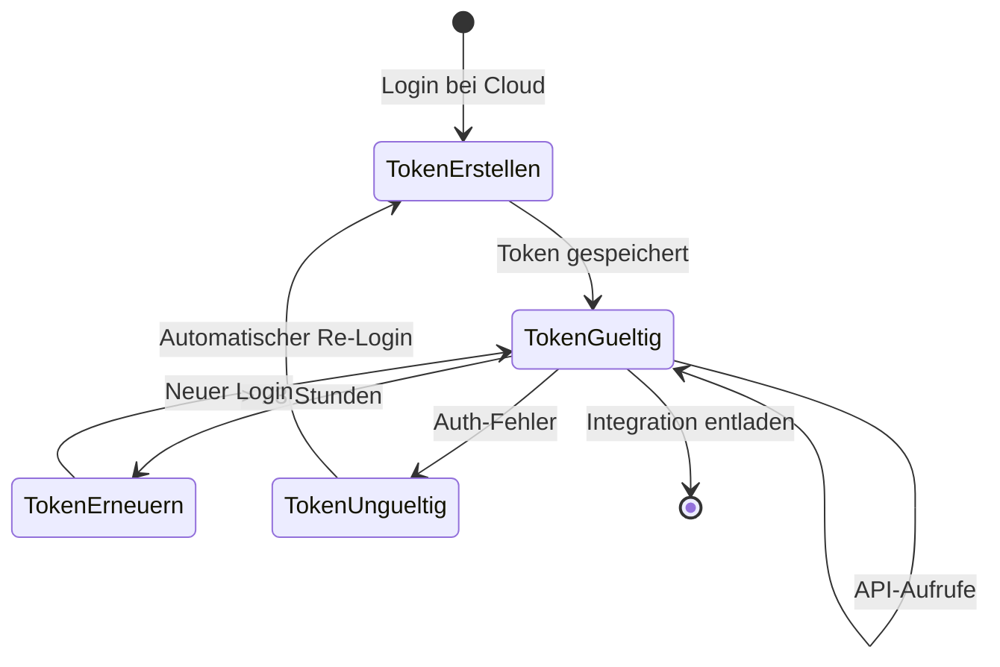

# CF Group Wärmepumpe für Home Assistant

[English](README.md) · [Deutsch](README.de.md)

[](https://hacs.xyz/)
[](https://github.com/Afraskai/cfgroup/releases)
[](LICENSE)

<p align="center">
  
</p>

Native Home-Assistant-Integration für CF Group / Aquatemp Wärmepumpen, die über die Linked-Go-Cloud gesteuert werden. Installierbar über HACS als Custom Repository.

Hersteller: [CF Group](https://www.cf.group/de/)

> **Hinweis:** Dies ist ein **inoffizielles** Community-Projekt und steht **in keiner Verbindung zu CF Group, Aquatemp oder Linked-Go**. Alle genannten Produktnamen, Logos und Marken sind Eigentum der jeweiligen Inhaber und werden hier nur zur Identifikation verwendet. Die Integration nutzt eine öffentliche Cloud-API, die sich jederzeit ohne Vorankündigung ändern oder ausfallen kann.

## Funktionen

- **Climate-Entity:** Wärmepumpe als Thermostat. TEP0001: `Heat`/`Off`. TEP0004: `Heat`/`Cool`/`Auto`/`Off` mit modusabhängigen Zieltemperaturen.
- **Sensoren:** Einlass-, Rücklauf-, Coil-, Umgebungs-, Ablufttemperatur sowie Betriebsmodus und Betriebszustand (Heizen / Kühlen / Abtauen). TEP0004 bietet zusätzlich einen Rücklufttemperatur-Sensor.
- **Abtau-Erkennung:** Binary-Sensor schaltet automatisch auf `an`, wenn die Pumpe abtaut (`dF` im Display).
- **Störungserkennung:** Binary-Sensor mit aktiven Fehlercodes (z. B. `E03 – Flow Switch Protection`) als Attribut.
- **Cloud-Status:** Diagnose-Sensor zeigt `Online` / `Offline`.
- **Switch:** Separater Power-Schalter.
- **Config Flow:** Einrichtung komplett über die Home-Assistant-Oberfläche.
- **Options Flow:** Abfrage-Intervall nachträglich änderbar.
- **Grenzwerte:** Min-/Max-Temperatur werden aus der Cloud gelesen und beim Setzen respektiert.

## Voraussetzungen

- **Home Assistant:** Version 2024.12 oder neuer.
- **Cloud-Account:** Zugangsdaten der CF Group / Aquatemp / Linked-Go App.
- **Internetverbindung:** Die Integration spricht direkt mit der Hersteller-Cloud.

## Getestete Hardware

| Modell | Beschreibung | Unterstützt |
|--------|--------------|-------------|
| `CF Pool Wärmepumpe SMART PLUS 3 kW` | Nur Heizen | ✅ TEP0001 |
| `CF PROFI 8 kW` | Heizen + Kühlen + Auto | ✅ TEP0004 |

> ⚠️ **Wichtiger Sicherheitshinweis:** Die Linked-Go-Cloud wird von vielen verschiedenen Wärmepumpen-Modellen genutzt, und die Hersteller belegen die technischen Codes (z. B. `R01`, `R04`, `Mode`, `Power`) **nicht einheitlich**. Auf einem anderen Modell kann derselbe Code eine völlig andere Bedeutung oder einen anderen Wertebereich haben. Wird die Integration ungeprüft auf einem fremden Modell verwendet, können dadurch falsche Werte geschrieben werden — bis hin zu Schäden am Gerät oder Sicherheitsrisiken.
>
> **Bitte prüfe vor der ersten Inbetriebnahme die Bedeutung der Codes in der Hersteller-App und vergleiche mit den Tabellen unten.**

## Protokoll-Codes

Die Cloud-API verwendet technische Codes. Diese können je nach Modell abweichen — bitte vor der Nutzung prüfen.

### TEP0001 – Nur Heizen (z. B. CF Pool Wärmepumpe SMART PLUS 3 kW)

#### Temperaturen

- **`R01`:** Zieltemperatur (Heiz-Sollwert).
- **`R04`:** Minimale Heiztemperatur.
- **`R05`:** Maximale Heiztemperatur.
- **`T02`:** Einlass-Wassertemperatur.
- **`T04`:** Coil-Temperatur.
- **`T05`:** Umgebungstemperatur.

#### Steuerung

- **`Power`:** Ein/Aus — `0` = aus, `1` = ein.
- **`Mode`:** Betriebsmodus (nur Heizen).
- **`ModeState`:** Status des aktuellen Betriebsmodus.

---

### TEP0004 – Heizen / Kühlen / Auto (z. B. CF PROFI 8 kW)

#### Temperaturen

- **`R01`:** Kühl-Sollwert.
- **`R02`:** Heiz-Sollwert.
- **`R03`:** Auto-Modus-Sollwert.
- **`T1`:** Rücklufttemperatur.
- **`T2`:** Einlass-Wassertemperatur.
- **`T3`:** Rücklauf-Wassertemperatur.
- **`T4`:** Coil-Temperatur.
- **`T5`:** Umgebungstemperatur.

#### Steuerung

- **`Power`:** Ein/Aus — `0` = aus, `1` = ein.
- **`Mode`:** Betriebsmodus — `0` = Kühlen, `1` = Heizen, `2` = Auto.
- **`State_mode`:** Aktiver Betriebszustand — `0` = Kühlen, `1` = Heizen.

## Installation

### Über HACS (empfohlen)

1. HACS öffnen und oben rechts im Menü `Benutzerdefinierte Repositories` wählen.
2. Repository-URL eintragen, Kategorie `Integration` wählen und hinzufügen.
3. `CF Group Wärmepumpe` in HACS installieren.
4. Home Assistant neu starten.
5. `Einstellungen → Geräte & Dienste → Integration hinzufügen` öffnen und nach `CF Group Wärmepumpe` suchen.

### Manuelle Installation

1. Den Ordner `custom_components/cfgroup_heatpump` in Dein Home-Assistant-Konfigurationsverzeichnis unter `config/custom_components/cfgroup_heatpump` kopieren.
2. Home Assistant neu starten.
3. `Einstellungen → Geräte & Dienste → Integration hinzufügen` → `CF Group Wärmepumpe`.

## Einrichtung

Im Einrichtungsdialog werden abgefragt:

- **Benutzername / E-Mail:** Wie in der Aquatemp-/Linked-Go-App.
- **Passwort:** Wie in der App.
- **Cloud-URL:** Nur bei Bedarf anpassen, der Standardwert passt in der Regel.

Nachträglich kann unter `Einstellungen → Geräte & Dienste → CF Group Wärmepumpe → Konfigurieren` das Abfrage-Intervall geändert werden. Minimum sind 60 Sekunden, um die Cloud-API zu schonen.

## Entwicklung und Tests

Automatisierte Tests laufen mit `pytest` direkt gegen den Cloud-Client (ohne Home-Assistant-Stack). Sie decken das Fehler-Handling, den automatischen Re-Login und die neuen Diagnose-Endpoints ab.

```bash
python3 -m venv .venv
.venv/bin/python -m pip install -r requirements-dev.txt
.venv/bin/python -m pytest tests/
```

## Projektstruktur

```text
custom_components/
  cfgroup_heatpump/
    __init__.py        Integrations-Setup
    manifest.json      HA-Metadaten
    const.py           Domain und Protokollcodes
    api.py             Async-Client für die Cloud
    coordinator.py     DataUpdateCoordinator (mit Offline-Toleranz)
    config_flow.py     UI-Einrichtung + Options-Flow
    entity.py          Gemeinsame CoordinatorEntity-Basis
    climate.py         Thermostat
    sensor.py          Temperaturen, Modus, Cloud-Status (Diagnose)
    binary_sensor.py   Störungs-Sensor (Diagnose)
    switch.py          Power-Schalter
    strings.json       Texte
    translations/
      de.json
      en.json
tests/                 pytest-Suite gegen den Cloud-Client
hacs.json              HACS-Metadaten
requirements-dev.txt   Test-Abhängigkeiten (pytest, aiohttp)
```

## Technische Architektur

### System-Architektur



### Temperaturänderung - Befehlsfluss



### Regelmäßiger Datenabruf



### Fehlerbehandlung bei Verbindungsausfällen



### Token-Management



### Zeitübersicht

| Schritt | Dauer |
|---------|-------|
| Temperatur-Befehl senden | 1-3 Sekunden |
| Cloud-Antwort erhalten | Max. 15 Sekunden |
| Wärmepumpe reagiert | Unbekannt (Hersteller-abhängig) |
| Home Assistant zeigt neuen Wert | Bis zu 180 Sekunden (nächster Poll) |

## Fehlerbehebung

- **Login schlägt fehl:** Benutzername und Passwort in der Hersteller-App prüfen.
- **Cloud nicht erreichbar:** Internetverbindung des Home-Assistant-Hosts prüfen.
- **Keine Geräte gefunden:** Der Account muss mindestens eine registrierte Wärmepumpe enthalten.
- **Logs:** `Einstellungen → System → Protokolle` öffnen und nach `cfgroup_heatpump` filtern.

## Lizenz und Haftungsausschluss

Dieses Projekt steht unter der **MIT-Lizenz**. Den vollständigen Text findest Du in [`LICENSE`](LICENSE).

Die Software wird **„wie sie ist" und ohne jegliche Gewährleistung** zur Verfügung gestellt – weder ausdrücklich noch stillschweigend. Das schließt insbesondere die Gewährleistung der Marktgängigkeit, der Eignung für einen bestimmten Zweck und der Nichtverletzung von Rechten ein. Die Autoren oder Rechteinhaber haften in keinem Fall für Ansprüche, Schäden oder sonstige Verbindlichkeiten, die sich aus der Nutzung dieser Software ergeben.

Die Nutzung erfolgt **auf eigene Gefahr**. Der Betrieb einer Wärmepumpe außerhalb der vom Hersteller empfohlenen Parameter kann das Gerät beschädigen, die Garantie erlöschen lassen oder Sicherheitsrisiken verursachen. Bitte beachte stets die Dokumentation des Herstellers.
